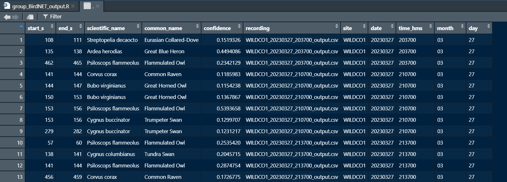

BirdNET instruction
================
Sunny Tseng
2023-04-17

### Pre-requisite

#### Google Colab (<https://colab.research.google.com/>)

You will need to sign in to Google Colab to get access to the computational resources provided by Google. If you have a Gmail account, you are all set. Enter the Google Colab webpage, then click the blue button `Sign in` at the upper right corner. Enter your Gmail and password, and you should be brought to the Colab main page.

#### Google Drive (<https://www.google.com/intl/en_ca/drive/>)

Here is where you are going to store the audio files that going to be analyzed by BirdNET. Create a folder called `BirdNET_WAV`, then upload your audio file(s) into the folder.

#### Python Notebook

Download the python script [BirdNET_Lite_JPRF.ipynb](./BirdNET_Lite_JPRF.ipynb) that is provided in this Github repository.

### Analysis

- Open the python notebook in Google Colab by clicking `File` -\> `Open notebook` -\> `Upload`, then locate or drag & drop the python notebook file that you just downloaded.

- Run the first two chunks of code. You can do this by clicking the arrow at the top left corner of the code chunk, or by entering `Ctrl + Enter` - the first chunk is to load the libraries, and the second chunk is to connect your Google drive with the Colab remote server, and also download the BirdNET algorithm to the remote server. Here is what you should see if everything goes well:

``` r
Mounted at /content/gdrive
Cloning into 'BirdNET-Lite'...
remote: Enumerating objects: 29, done.
remote: Total 29 (delta 0), reused 0 (delta 0), pack-reused 29
Unpacking objects: 100% (29/29), 58.09 MiB | 10.00 MiB/s, done.
```

- Click on the folder icon on the left panel - you should see the file structure in your remote server, where `BirdNET-Lite` and `gdrive` should both appear. The `BirdNET-Lite` folder includes all the identification algorithms and the `gdrive` is basically your Google Drive, which is now a folder in the remote server. 

- Run the third chunk of the code to change the current working directory to `BirdNET-Lite`.

- Now we are at the firth chunk of the code, where the main analysis is happening. The code basically loop through all the `.wav` file in the `BirdNET_WAV` folder then produce outcome in a newly created folder called `BirdNET_WAV_output` in your Google Drive (the code will create this folder for you so you don't need to do it by yourself). 


- Run the forth chunk of the code. You should see something like this if you succeed :) This might take a while depending on how many recordings you have. Each 1-mins audio recording would probably takes about 5-secs to analyze. 

``` r
INFO: Created TensorFlow Lite delegate for select TF ops.
INFO: TfLiteFlexDelegate delegate: 1 nodes delegated out of 182 nodes with 1 partitions.

INFO: Created TensorFlow Lite XNNPACK delegate for CPU.
LOADING TF LITE MODEL... DONE!
READING AUDIO DATA... DONE! READ 37 CHUNKS.
ANALYZING AUDIO... DONE! Time 5.0 SECONDS
WRITING RESULTS TO BirdNET_output.txt ... DONE! WROTE 5 RESULTS.
```

- If you are still following, congrats! Now to look up your result, go to your Google Drive and find the `BirdNET_WAV_output` folder. You should see the many `.csv` files there. Each `.csv` file corresponds to each sound recording. You should be able to see which birds are included in the recording by reading through the `.csv` file. 

### Combine all `.csv` files into one metadata

- To combine the `.csv` files into only one file, download the `BirdNET_WAV_output` into your computer. Put the folder at the same working directory with the R code `group_BirdNET_output.R`. 

- Run the the `group_BirdNET_output.R` in RStudio then you will get the final combined object, which is called `data_full_format`. Here is how the data should look like:



### Well done :)
